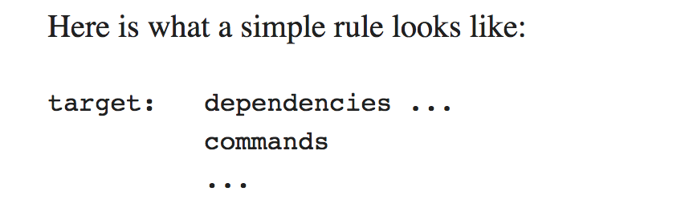

# Learn C The Hard Way
* I studied and programmged thousands of lines of C code 2 years ago. As part of my plans to dive deeper into Operating Systems, I'm refershing my C via this book and more. What follows is selected notes from the book.

### Overview
* book not really about learning C
  * become better defensive programmer
  * understand legacy code

### The Undefined Behaviorists
* ways to write C for which compiler can disregard what's written
  * example: NUL Byte Overruns

### C Compilation Process
* **Preprocessing** -> analyzes preprocessor commands, lines starting with #, are **macros** which form own language
  * practically -> **inlines libraries, i.e., <stdio.h>**
* **Compilation** (name is confusing) -> C code to **assembly specific** to **target processor architecture**
  * allows for C programs to contain inline assembly instructions
  * some C compilers include integrated assemblers avoiding the need to invoke an assembler and this intermediate stage
* **Assembly** -> assembler used to translate the **assembly to machine code (also known as object code)**
* **Linking** -> rearrange machine code; **merges various modules from source files**
  * linker -> arranges pieces of machine code so that functions in some pieces can call functions in other pieces
  * **final stage** -> **produces single executable file**

### Make

* [Make](https://www.gnu.org/software/make/) -> controls the genereation of executables and other non-source files of a program from the program's source files
  * Makefile -> tells make how to compile and link a program
      * [examples](http://www.cs.colby.edu/maxwell/courses/tutorials/maketutor/)
    * enables end user to build and **install package without knowing details**
    * **not limited** to particular language (or even programming for that matter)
    * Rules and Targets
      * rule -> **how** to execute a series of commands to **build a target file** from source files
        * specifies list of dependencies of the target file
        * target -> usually the name of a file generated by the program
        * prerequisite -> file that is used as input to create target
        * recipe -> action that make carries out
          * may have more than 1 command
      * can specify which targets to update; otherwise, Make will update first target
    * Phony Target -> one that is not really the name of a file
      * name for a recipe to be executed when you make an explicit request
      * can be used to avoid name conflict with a file and a target and performance
  * How Make Works -> **declare dependencies** and then **describe how to build them**
    * relies also on the program's internal knowledge of how to build most common software
    * recompilation -> done if the source file, or any header files named as pre-reqs, is more recent than the object file, or if the object file does not exist
      * make is smart enough to **only recompile files that have changed**
      * sidenote -> linkage takes care of name resolution in C
        * whether two or more declarations for that name are valid

* sidenote / reminder: can pass ENV variables before running a command and they will be set accordingly only during that command

### Formatted Printing
* self-sufficient programmer -> force yourself to answer your own question first, and then confirm that your answer is right

### Using a Debugger
* [GNU Debugger](https://www.gnu.org/software/gdb/) -> default linux debugger
* [LLDB](https://lldb.llvm.org/) -> MacOS **interactive debugging console**
  * command structure -> <noun> <verb> [-options [option value]] [argument [argument...]]
  * [commands](https://lldb.llvm.org/lldb-gdb.html)
* [Valgrind](http://valgrind.org/docs/) -> instrumentation for building **dynamic analysis tools**, i.e., **memory management** and **threading issues**
  * used primarily for memory checks in this book

### Memorizing C Operators
* insists memorizing is important, reccommends something like anki
  * I already know most of these so skipping them

### Memorizing C Syntax
* already know most but will add some Anki
* keywords -> make up words that augment symbols so that the language reads well together
  * C has concept of [Storage Classes](https://web.archive.org/web/20130927234242/http://itee.uq.edu.au/~comp2303/Leslie_C_ref/C/CONCEPT/storage_class.html)
    * define the scope (visibility) and lifetime of variables and/or functions
      * auto -> default; can only be used within functions
      * register -> store in register on CPU instead of in RAM
        * fastest way to access data
      * static -> default for global variables
      * extern -> global variable visible to ALL object modules

### Variables and Types
* C treats all chars as integers, which allows you to do math on them
* [In-Depth Integer Overflow](https://www.cs.utexas.edu/~shmat/courses/cs380s_fall09/blexim.txt)
  * bottom line -> two unsigned integers can never exceed number of bits of type so result will wrap around larget value + 1 (MAXINT + 1)

### If, Else If, Else
* no real Boolean type in C -> 0 for false, 1 for true

### Switch Statements
* in Ruby, switch statement acts like if internally
* in C, switch is actually a **jump table**
  * can only put expressions that results in integers
  * integers used to calculate jumps from top of the **switch** to the part(case) that matches the value
  * avoid fallthrough unless really desired

### Arrays and Strings
* setting just one element means rest of array will be filled with 0
* nul byte, '\0', isn't visible when printed
* source of almost all C bugs comes from forgetting to have enough space or forgetting to put a '\0' at the end of a string

### Sizes and Arrays
* sizeof operator -> returns number of bytes of data type or identifier
* int type is believed to be 4 bytes and varies based on bit-size of CPU (i.e., 32-bit vs 64-bit)
  * Compiler developers make reasonable choices based on underlying processors [stack](https://stackoverflow.com/questions/2331751/does-the-size-of-an-int-depend-on-the-compiler-and-or-processor)

### For Loops and Arrays of Strings
* C constructs arrays of strings as 2-dimensional array of nested char arrays
* comma operator can be used in for loop for things like multiple assignments
* NULL -> null pointer constant which means it points to an invalid object
  * attempting to read / dereference leads to undefined behavior

### Pointers
* pointer -> simply an address pointing somewhere inside the computer's memory with a type specifier so that you get the right size of data with it
  * **useful primarily when**:
    * manipulating raw chunk of memory when using malloc
    * pass large blocks of memory to functions with a pointer to avoid passing whole thing
    * take the address of function to use it later as a dynamic callback
    * scan complex chunks of memory

### Structs and Pointers to Them
* if I have a create function (one that uses malloc), I always need a destroy function
* structure -> collection of different data types (variables) that are stored in one block of memory
  * can access each variable independently by name
  * C handles memory structuring of these compound data types
    * requires breaking up block of memory accordingly for different type and keep track of where each field lives in memory
