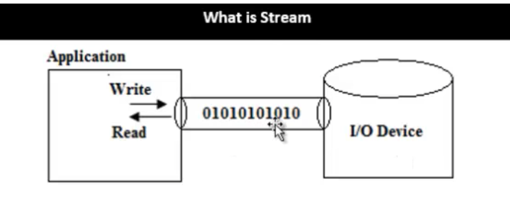

# Learn C The Hard Way
* I studied and programmged thousands of lines of C code 2 years ago. As part of my plans to dive deeper into Operating Systems, I'm refershing my C via this book and more. What follows is selected notes from the book.

### Overview
* book not really about learning C
  * become better defensive programmer
  * understand legacy code

### The Undefined Behaviorists
* ways to write C for which compiler can disregard what's written
  * example: NUL Byte Overruns

### C Compilation Process
* **Preprocessing** -> analyzes preprocessor commands, lines starting with #, are **macros** which form own language
  * practically -> **inlines libraries, i.e., <stdio.h>**
* **Compilation** (name is confusing) -> C code to **assembly specific** to **target processor architecture**
  * allows for C programs to contain inline assembly instructions
  * some C compilers include integrated assemblers avoiding the need to invoke an assembler and this intermediate stage
* **Assembly** -> assembler used to translate the **assembly to machine code (also known as object code)**
* **Linking** -> rearrange machine code; **merges various modules from source files**
  * linker -> arranges pieces of machine code so that functions in some pieces can call functions in other pieces
  * **final stage** -> **produces single executable file**

### Make

* [Make](https://www.gnu.org/software/make/) -> controls the genereation of executables and other non-source files of a program from the program's source files
  * Makefile -> tells make how to compile and link a program
      * [examples](http://www.cs.colby.edu/maxwell/courses/tutorials/maketutor/)
    * enables end user to build and **install package without knowing details**
    * **not limited** to particular language (or even programming for that matter)
    * Rules and Targets
      * rule -> **how** to execute a series of commands to **build a target file** from source files
        * specifies list of dependencies of the target file
        * target -> usually the name of a file generated by the program
        * prerequisite -> file that is used as input to create target
        * recipe -> action that make carries out
          * may have more than 1 command
      * can specify which targets to update; otherwise, Make will update first target
    * Phony Target -> one that is not really the name of a file
      * name for a recipe to be executed when you make an explicit request
      * can be used to avoid name conflict with a file and a target and performance
  * How Make Works -> **declare dependencies** and then **describe how to build them**
    * relies also on the program's internal knowledge of how to build most common software
    * recompilation -> done if the source file, or any header files named as pre-reqs, is more recent than the object file, or if the object file does not exist
      * make is smart enough to **only recompile files that have changed**
      * sidenote -> linkage takes care of name resolution in C
        * whether two or more declarations for that name are valid

* sidenote / reminder: can pass ENV variables before running a command and they will be set accordingly only during that command

### Formatted Printing
* self-sufficient programmer -> force yourself to answer your own question first, and then confirm that your answer is right

### Using a Debugger
* [GNU Debugger](https://www.gnu.org/software/gdb/) -> default linux debugger
* [LLDB](https://lldb.llvm.org/) -> MacOS **interactive debugging console**
  * command structure -> <noun> <verb> [-options [option value]] [argument [argument...]]
  * [commands](https://lldb.llvm.org/lldb-gdb.html)
* [Valgrind](http://valgrind.org/docs/) -> instrumentation for building **dynamic analysis tools**, i.e., **memory management** and **threading issues**
  * used primarily for memory checks in this book

### Memorizing C Operators
* insists memorizing is important, reccommends something like anki
  * I already know most of these so skipping them

### Memorizing C Syntax
* already know most but will add some Anki
* keywords -> make up words that augment symbols so that the language reads well together
  * C has concept of [Storage Classes](https://web.archive.org/web/20130927234242/http://itee.uq.edu.au/~comp2303/Leslie_C_ref/C/CONCEPT/storage_class.html)
    * define the scope (visibility) and lifetime of variables and/or functions
      * auto -> default; can only be used within functions
      * register -> store in register on CPU instead of in RAM
        * fastest way to access data
      * static -> default for global variables
      * extern -> global variable visible to ALL object modules

### Variables and Types
* C treats all chars as integers, which allows you to do math on them
* [In-Depth Integer Overflow](https://www.cs.utexas.edu/~shmat/courses/cs380s_fall09/blexim.txt)
  * bottom line -> two unsigned integers can never exceed number of bits of type so result will wrap around larget value + 1 (MAXINT + 1)

### If, Else If, Else
* no real Boolean type in C -> 0 for false, 1 for true

### Switch Statements
* in Ruby, switch statement acts like if internally
* in C, switch is actually a **jump table**
  * can only put expressions that results in integers
  * integers used to calculate jumps from top of the **switch** to the part(case) that matches the value
  * avoid fallthrough unless really desired

### Arrays and Strings
* setting just one element means rest of array will be filled with 0
* nul byte, '\0', isn't visible when printed
* source of almost all C bugs comes from forgetting to have enough space or forgetting to put a '\0' at the end of a string

### Sizes and Arrays
* sizeof operator -> returns number of bytes of data type or identifier
* int type is believed to be 4 bytes and varies based on bit-size of CPU (i.e., 32-bit vs 64-bit)
  * Compiler developers make reasonable choices based on underlying processors [stack](https://stackoverflow.com/questions/2331751/does-the-size-of-an-int-depend-on-the-compiler-and-or-processor)

### For Loops and Arrays of Strings
* C constructs arrays of strings as 2-dimensional array of nested char arrays
* comma operator can be used in for loop for things like multiple assignments
* NULL -> null pointer constant which means it points to an invalid object
  * attempting to read / dereference leads to undefined behavior

### Pointers
* pointer -> simply an address pointing somewhere inside the computer's memory with a type specifier so that you get the right size of data with it
  * **useful primarily when**:
    * manipulating raw chunk of memory when using malloc
    * pass large blocks of memory to functions with a pointer to avoid passing whole thing
    * take the address of function to use it later as a dynamic callback
    * scan complex chunks of memory

### Structs and Pointers to Them
* if I have a create function (one that uses malloc), I always need a destroy function
* structure -> collection of different data types (variables) that are stored in one block of memory
  * can access each variable independently by name
  * C handles memory structuring of these compound data types
    * requires breaking up block of memory accordingly for different type and keep track of where each field lives in memory

### Heap and Stack Memory Alloction
* **stream** -> common, **logical interface** to **various devices** that compromise the computer

  * **any hardware device** (disk file, the screen, the keyboard, a socket, etc.) will **look like another** to a programmer
  * **FILE** -> **C structure** that holds various kinds of **information** about **stream objects**, such as **size** and **file position**
    * defined in stdio.h
  * file -> most important form of stream; represents an array of bytes, regardless of it being a text file or binary file
    * on disk as continuous series of streams that has one starting point and one ending point
      * all data stored in binary, whether "text" or "binary" file
        * **text file** -> **all units of data** are **1 byte** which represents **1 character**
          * **need** to **know** the type of **encoding** to can read characters from text stream
        * **binary file** -> continuous series of bits where **unit of data is not fixed** as it can be **any data type** (int, float, char, etc.)
  * standard streams (possible to redirect any of these streams)
    * `FILE *stdin` -> standard input stream, normal source of input for program
    * `FILE *stdout` -> standard out stream, normal source of output for program
    * `FILE *stderr` -> used for error messages and diagnostics for program
  * **buffering** -> **dealing with data in blocks** instead of one unit at a time
    * characters that are written to a stream are normally accumulated and transmitted asynchronously to the file in a block
    * streams often receive input from the host environment in blocks rather than character by character
    * **buffering strategies**
      * unbuffered stream -> transmitted individually to or from the file as soon as possible
      * line buffered stream -> transmitted to the file in blocks when a newline character is encountered
      * fully buffered stream -> transmitted to the file in arbitrary block sizes
    * **flushing buffers** -> **transmitting all** accumulated characters to the file **at once** in a buffered stream
      * buffered output on a stream is flushed automatically when:
        * buffer if full
        * stream is closed
        * program terminates
        * input operation reads data
* Low-Level Input/Output
  * performed directly on file descriptors
  * generally prefer performing operators on streams unless necessary to use file descriptors
    * **file descriptors** -> number in OS that **uniquely identifies an opened file**
* Stack vs Heap Allocation
  * Stack
    * C compiler puts all temporary variables, i.e., arguments to a function, are put onto the stack
      * when function exits / returns, C compiler pops these variables off stack to clean up
  * Heap
    * remaining chunk of memory in computer after stack that you access with malloc
    * malloc is an OS function that returns a pointer to a piece of memory of the size you requested
  * primary problems
    * losing track of pointer to block of memory
    * too much data on stack, i.e, when allocating large structs and arrays
    * take a pointer to something on the stack, than pass and return it from function, the function receiving it will segfault, because the actual data will get popped off and disappear, pointing at dead space
* Database Project -> much more in-depth than past and cool; should highlight
* [Struct Packing](http://www.catb.org/esr/structure-packing/) -> about **reducing** the **memory footprint** of programs in compiled programs like C
  * useful when writing code for **memory-constrained** embedded **systems** or OS kernels
  * useful working with data sets in program that routinely hits memory limits
  * useful topic in other compiled languages with C-like structures, i.e., Go and Rust
  * a lot less important topic recently because:
    * CS has steered people away from micro-optimizations towards better algos
    * machine resources have made squeezing memory less important
  * Alignment Requirements
    * storage for basic C datatypes on an x86 or ARM doesn't normally start at arbitrary addresses; each type has an alignment requirement
      * 1 byte char on any byte address
      * 2 byte shorts on even address
      * 4 byte int on address divisible by 4
    * basic C types are **self-aligned**
    * [Geeks](https://www.geeksforgeeks.org/structure-member-alignment-padding-and-data-packing/)
      * mandated by the processor architecture
      * historically memory is byte addressable and arranged sequentially
        * **arranged as a group to reduce number of memory cycles to fetch data**
          * i.e., if an integer is allocated at an address that is not a multiple of 4, it will require 2 memory cycles to fetch
  * in general, **struct instance** will have the **alignment** of its **widest scalar member** -> easiest way to ensure that all the members are self-aligned for fast access
    * **compiler pads with "padding bytes" when necessary**
    * 
  * Bitfields -> give you the ability to declare structure fields of smaller than character width, down to 1 bit
  * Structure Reodering -> avoid padding bytes
    * simplest way is to reorder the structure members by decreasing alignment

### Segway -> [ProgramStartUp](http://dbp-consulting.com/tutorials/debugging/linuxProgramStartup.html)
* first thing that's run is a function linked to every program named `_start`
* how do we get to `_start`?
  * shell calls `execve()` which sets up a stack and pushes argc, argv, and envp
  * file desctipions 0, 1, 2 (stdin, stdout, stderr) are left to whatever shell set them to
  * when everything is ready, control is finally handed over to `_start`
* `_start`
  * sets up stack memory alignment for memory and cache efficiency
* `_libc_start_main`
  * starts up threading
  * calls init argument
  * calls `main` with `argc` and `argv`
* **enough for now** come back and visit when taking OS course

### Pointers to Functions
